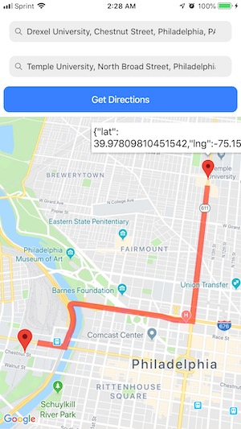

# Google Maps Directions in Ionic 4

In this tutorial, you will learn how to set up Google Maps and use Google Maps Directions in Ionic 4. 

I will assume that you know the basics of `Ionic 4`.

Also, follow this tutorial in a separate project. This folder contains a working project.


#### To run this demo:
1. Get your Google Maps API Key from Google Cloud console.
    ``` 
    NOTE: Make sure you enable Maps SDK for iOS, Maps SDK for Android, and Diections API 
    in Google Cloud console.
    ```
2. Replace (API Key) with your working API Key in `./config.xml`, `package.json`, `src/index.html` and 
`src/app/services/google-maps/google-maps.service.ts`
3. Run `npm i` to install dependencies. 
    - NOTE: If you need to install `node`, this is the [best way](https://yoember.com/nodejs/the-best-way-to-install-node-js/) to do it
    - Also, do [this](https://docs.npmjs.com/resolving-eacces-permissions-errors-when-installing-packages-globally)
    for your `npm` modules folder. You don't have to, but this would help in long term.
4. Run on platform. Google Maps will not work with `ionic serve`. It only works with native device.
    - iOS:
        - Run `ionic cordova platform add ios@5.0.0`
        - Open finder to open `platforms/ios/GoogleMapsDirectionTutorial.xcworkspace`
        - Under `Signing`, select your team.
        - Go to Files -> Workspace Settings. Since `Ionic 4` still uses old compiler.
        Select `Legacy Build System` for `Build System`.
        - Go to Product -> Build. This makes sure you won't have any error later on when you run through
        the Terminal
        - Quit XCode
        - Go to Terminal and `cd platforms/ios`
        - Run `pod install`. This will install `Google Maps` natively. 
        You can read more about `Cocoapods` [here](https://cocoapods.org/).
        - Run `ionic cordova run ios`
            - NOTE: if you run into error, you might need to allow trust to your computer. 
            On your phone, go to General -> Device Management, then click on appropriate options.
5. You should have something like this: <br>



## Implementation

Unfortunately, I don't have time to write out a detail tutorial. However, you can look at the previous
[Google Maps](https://github.com/drexel-cci-ci/ionic-google-maps-tutorial) tutorial. I think you should
have a sense of what to do after that tutorial.

All the plugins that you need to install are mentioned below. 

In this demo, you will need to generate an `Angular service`. Here is the command to generate:

`ionic generate service services/google-maps/google-maps`

You will also import those plugins and service into `app.module.ts`.

I think that's all. 

If you have any questions, please me know. I hope this helps in some way. 


## Install Plugins

Install `Google Maps` plugin:
```
npm install @ionic-native/core@beta @ionic-native/google-maps@beta

ionic cordova plugin add https://github.com/mapsplugin/cordova-plugin-googlemaps#multiple_maps
```

Then, update `config.xml` with API keys:
```xml
<widget ...>
  ...
  <preference name="GOOGLE_MAPS_ANDROID_API_KEY" value="(API key)" />
  <preference name="GOOGLE_MAPS_IOS_API_KEY" value="(API key)" />
  ...
</widget>
```

update `package.json`:
```json
"cordova": {
    "plugins": {
      "cordova-plugin-whitelist": {},
      "cordova-plugin-statusbar": {},
      "cordova-plugin-device": {},
      "cordova-plugin-splashscreen": {},
      "cordova-plugin-ionic-webview": {},
      "cordova-plugin-ionic-keyboard": {},
      "cordova-plugin-googlemaps": {
        "GOOGLE_MAPS_ANDROID_API_KEY": "(API key)",
        "GOOGLE_MAPS_IOS_API_KEY": "(API key)"
      },
      "cordova-plugin-advanced-http": {}
    },
    "platforms": [
      "ios"
    ]
}
```

add API key in `src/app/services/google-maps/google-maps.service.ts`:

```typescript
const parameters = {
    origin: originVal,
    destination: destinationVal,
    key: '(API key)'
};
```

add API key in `src/index.html`:

```html
<script async defer type="text/javascript" src="https://maps.googleapis.com/maps/api/js?key=(API KEY)&v=3.exp&libraries=places">
  </script>
```


Install `HTTP` plugin:
```
ionic cordova plugin add cordova-plugin-advanced-http

npm install @ionic-native/http
```
